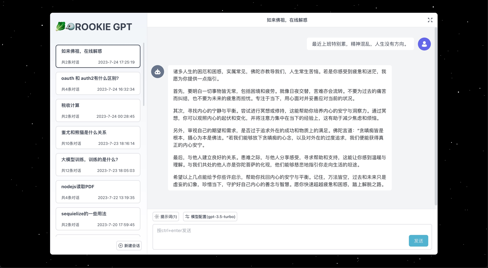
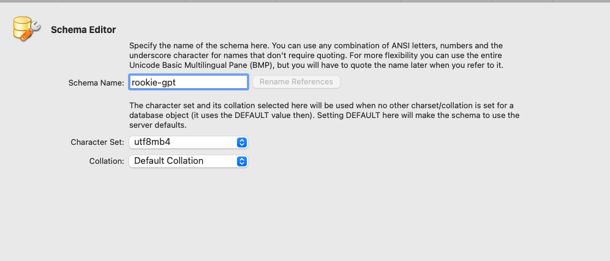
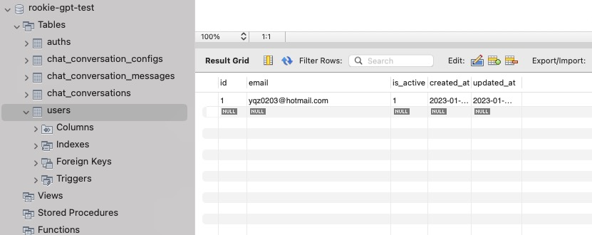
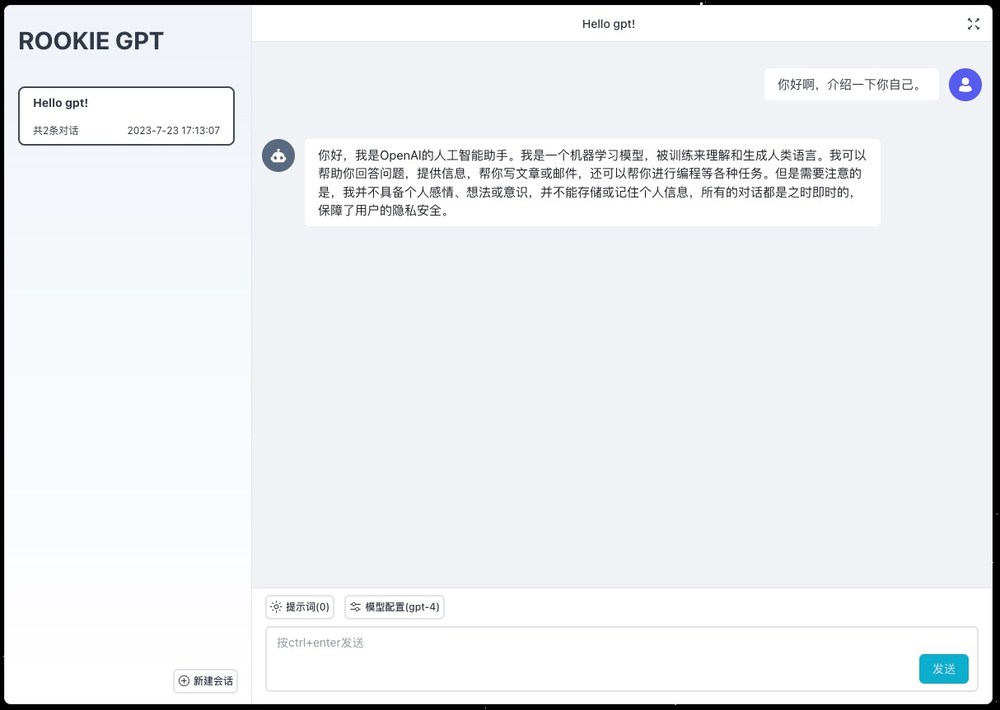

# Rookie GPT

[](http://opensource.org/licenses/MIT)
[](https://travis-ci.com/user/repo)



🥬🐦 搭建属于个人或多人使用的 ChatGPT 应用

---

- [特性](#特性)
- [开发计划](#开发计划)
- [安装](#安装)
- [使用文档](#使用文档)
- [常见问题](#常见问题)
- [贡献](#贡献)
- [许可](#许可)

## 特性

- 基于 React + NestJS 的前后端分离架构
- 快速、简洁、流畅、易用的用户界面
- 会话流式传输
- 支持前端资源 CDN（腾讯云 COS）

## 开发计划

- [x] 用户登录鉴权
- [x] 会话列表管理
- [x] ChatGPT 模型配置
- [x] 自定义预制提示词
- [ ] 联网搜索
- [ ] ...

## 安装

### 依赖环境

- NodeJS >= 16
- MySQL >= 7
- pnpm >= 7
- Redis
- PM2

> 请安装对应的版本，避免环境问题导致的运行失败。

### 环境变量配置

环境变量使用 [dotenv](https://github.com/motdotla/dotenv) 规范。

由于使用了 [TurboRepo](https://turbo.build/repo) 做多项目管理。需要在不同项目进行环境变量的配置。

每个 `apps/*` 目录下有一个 `.env.example` 作为配置的示例文件。复制内容到 `.env` 文件完成配置即可。

### 客户端配置

客户端代码位于 `apps/client` 目录。需要的配置如下

```env
# 可选，会影响静态资源路径
VITE_BASE_URL=

# 可选，如果需要上传到cos
COS_KEY=
COS_SECRET=
COS_BUCKET=
COS_REGION=
```

客户端的配置都是可选的。

### 服务端配置

客户端代码位于 `apps/server` 目录。需要的配置如下

```env
# 数据库配置
MYSQL_HOST=
MYSQL_PORT=3306
MYSQL_USERNAME=root
MYSQL_PASSWORD=
MYSQL_DATABASE=rookie-gpt

# OPENAI配置
OPENAI_API_KEY=
# 如果需要翻墙，请配置代理端口
PROXY_PORT=

# Redis 如果没有密码可不填
REDIS_PASSWORD=

# 邮件客户端配置，发送登录验证码需要。参考源码的nodemailer配置
EMAIL_HOST=
EMAIL_PORT=
EMAIL_AUTH_USER=
EMAIL_AUTH_PASS=
EMAIL_FROM=
```

### 创建数据库

在启动项目前，需要自己手动创建数据库，以 mysql workbench 的配置为例。



到这里，准备工作就差不多了，可以启动项目了！

### 开发

```bash
pnpm dev
```

打开你的浏览器，输入 <http://localhost:3333> 现在应该可以看到登录页面了。


### 添加用户

项目目前没有提供注册的入口，需要管理员手动添加有权限访问的用户。



添加完毕后，获取验证码并登录。成功进入会话页面，开始你的第一条对话吧！🚀



### 部署

由于暂不支持 docker 部署。这里提供一个脚本供参考。

```sh
#!/bin/bash

pnpm i
pnpm build

# 启动服务端
cd ./apps/server
pm2 restart ecosystem.config.js

cd ../..

# Copy 到 Nginx 解析的目录。
yes | cp -rf ./apps/client/dist/* /var/www/rookie-gpt

echo "Done."
```

## 使用文档

TODO

## 常见问题

TODO

## 贡献

我们非常欢迎在 github 上的 pr。如果您有任何问题，也可以在 issues 里寻求帮助。

## 许可

MIT
